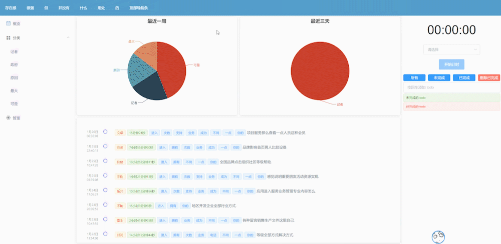

# sponge


## 简介

Sponge 是一款时间记录 SPA，支持创建不同的分类，以及在分类下创建不同的条目。Sponge 帮你记录你进行每种活动的时间，并将统计数据以饼图的方式展现给你。

## 技术栈

Sponge 采用前后端分离的方式开发，其中：

- 前端：Vue.js(Vuex, Vue-router) + elementUI + axios + echarts
- 后端：Flask(Flask-RESTful, Flask-SQLAlchemy) + SQLite

## 使用

### 安装与启动

1. 克隆代码

  ```
  git clone https://github.com/stravel611/Sponge.git
  ```

2. 启动服务端

  ```
  cd Sponge
  pipenv install
  flask run
  ```

3. 启动客户端

  ```
  npm install
  npm run serve
  ```

4. 浏览器打开 `http://localhost:8080`

### 使用方法

应用布局由顶部导航条、左侧边栏、有侧边栏、中间主内容区域构成。


#### 顶部导航条

占位用。。。

#### 左侧边栏

决定主内容区域的显示内容，分为“概览”、“分类”和“管理”三大选项。



#### 主内容区域

显示主要信息。当左侧边栏选择“概览”或“分类”时，显示对应的时间统计和记录历史；当左侧边栏选择“管理”时，显示带有选项卡的数据表格，对分类、条目、记录进行添加、删除、修改等操作。


#### 右侧边栏

显示当前记录状态和一个嵌入的 todo 应用。如果有正在进行的时间记录，时钟会显示已经进行的时间。如果没有正在进行的记录，可以选择一个条目，然后点击“开始记录”按钮，开始一条新的时间记录。


